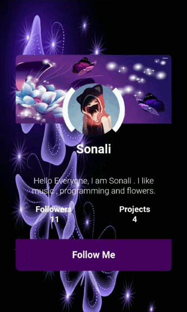

<h1 align="center">Hi 👋, I'm Sonali Kumari</h1>
<h3 align="center">Frontend developer from India</h3>

  

  

- 🌱 I’m currently learning *Django and DSA*

- 👯 I’m looking to collaborate on *Open Source Projects*

- 💬 Ask me anything about *My Codes*

- 📫 How to reach me *sonalirai161161@gmail.com*

- ⚡ Fun fact *I think I am not funny😂*

<h3 align="left">Connect with me:</h3>

<h3 align="left">Languages and Tools:</h3>

           

&nbsp;

 

 

